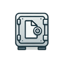

# cripty
## The personal vault on your computer

A personal safe where you can insert files and keep them encrypted and secure. Everything stored locally on your machine

### 1 - Vaults
A Vault is a folder in your computer where your secret files are stored.
These files are encrypted, so you can't open them. 
By default, vaults are stored in /home/$USER/.cripty/ (For Linux). You can't change a vault path (function still not implemented)

### 2 - Usage

#### 2.1 System requirements

To run this software, Python 3.10.12 or a greater version must be instaled.   
You can check your Python version by running:

    python3 --version

You must also install the following libraries:

<ul>
    <li>bcrypt</li>
    <li>base64</li>
    <li>PyQt5</li>
    <li>configparser</li>
    <li>secrets</li>
    <li>pycryptodome</li>    
</ul>

To install them, you can use:

    pip install -r requirements.txt

#### 2.2 - Linux
Use

    python3 main.py

to run cripty. If no vault is found, the program will open the "Vault setup wizard", which guides you creating a vault.   
Else, it will ask you to log in into your vault, with vault name and password.

#### 2.3 - Windows

A the moment, this software isn't compatible with Windows.  
I Will make this software cross-platform as soon as possible.

### 3 - Create a Vault

From the login page, click on "New vault button" to open the Vault creation wizard. 
You will be asked to insert the vault name and a password, to save the generated security key (<b>3.1 - vault security key</b>), and the encryption type (<b>3.2 - Vault encryption types</b>)

#### 3.1 - Vault security Key

The vault security key is a random generated key stored in a file.  
if you forget the password of your vault, you can change it using this key, from the lgin page.  
If you need to delete a vault (see section <b>4 - Remove a Vault</b>), you must provide the security key file.

#### 3.2 - Vault encryption types

Cripty offers you the possibility to choose the encryption key size for securing your files.  
You can select a key length of 16, 24, or 32 bytes, corresponding to 128, 192, or 256-bit encryption in the AES algorithm.  
Each key size provides a different level of security and performance:

<ul>
    <li>16 bytes (128-bit): Offers a strong level of security with faster processing, suitable for most users and scenarios.</li>
    <li>24 bytes (192-bit): Balances security and performance, providing an extra layer of protection for sensitive data.</li>
    <li>32 bytes (256-bit): Delivers the highest level of security, ideal for safeguarding critical or highly confidential files, though it may slightly impact performance.</li>
</ul>

### 4 - Remove a Vault

To permanently delete a vault, simply click the "Remove Vault" button on the login screen.  
For security purposes, you will be required to enter the associated username and the correct security key.

This process ensures that only authorized users can remove a vault and all its encrypted contents. 
Once confirmed, the vault and all its data will be irreversibly deleted. Be cautious, as this action cannot be undone or interruptd.

